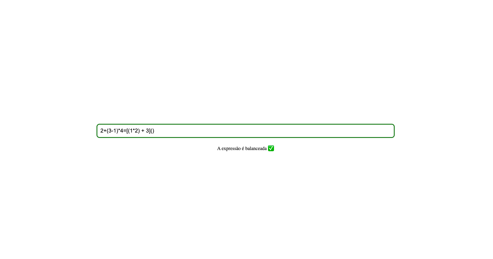
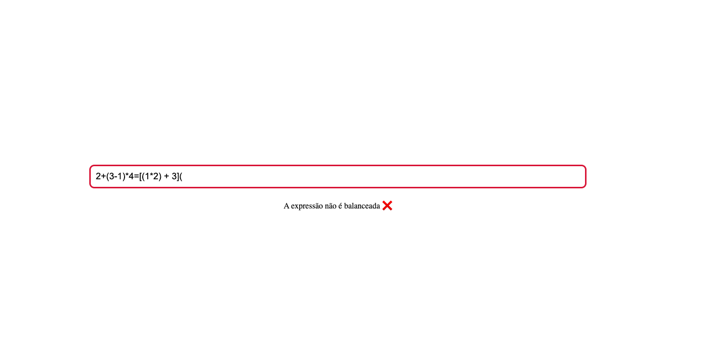

# Aplicação que verifica se a expressão é balanceada

## link de deploy - Netlify 
https://balaced-value-app.netlify.app/

## Usabilibilida 

Inserir a expressão dentro do input para validar se a expressão é banceada

## Scripts disponíveis

###  para clonar o repositório

git clone  https://github.com/GeoChivas99s/balanced-value-app.git

### instalar dependencias 

yarn install

###  rodar o projecto em ambiente local
 
yarn start